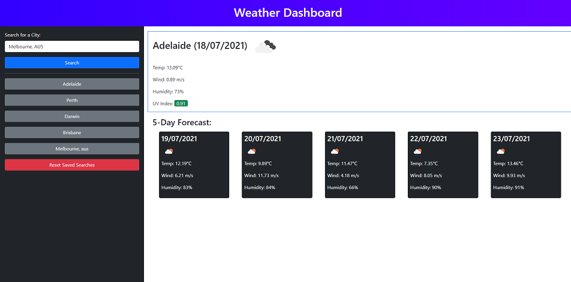

# Weather Dashboard

## Description
A webapp that displays weather data for your city!

In this project I have used bootstrap to style the page, OpenWeatherAPI and Javascript to dynamically generate the content (including using localStorage to have saved data persist between page refreshes) and DayJS to get the current time.

## Usage

Enter a city name into the search bar and click submit. Weather forecast data will populate the page. 

Previous searches will populate the sidebar (and persist between pageloads), simply click on the button to get the data for that city again.

The completed website can be viewed at: https://rileylum.github.io/weather-dashboard/

## Credits

I used the OpenWeatherMap API to get the weather forecast data which can be found here: https://openweathermap.org/

I used bootstrap for the styling which can be found at: https://getbootstrap.com/

I used dayJS for interacting with time which can be found at: https://day.js.org/
